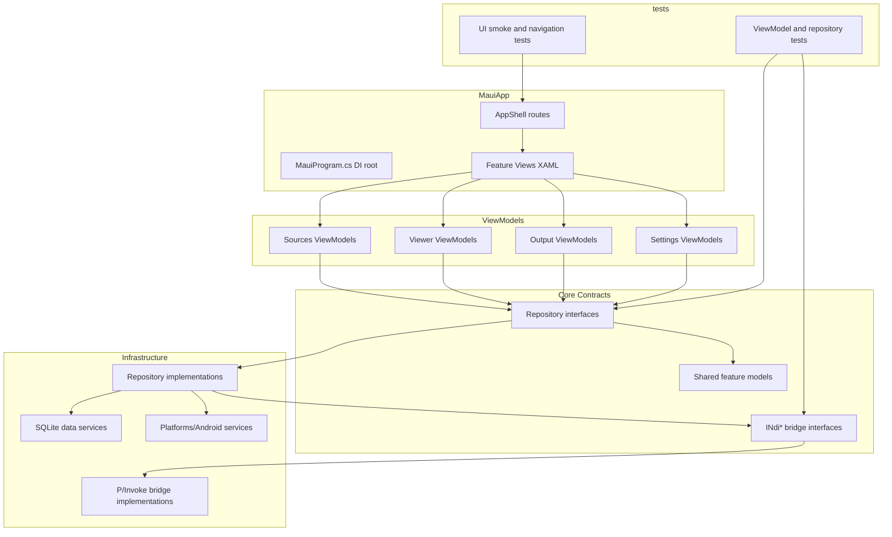

<!-- Last updated: 2026-06-08 -->

# Architecture

This guide defines the active MAUI architecture baseline for NDI-for-Android and supersedes legacy Kotlin module descriptions for current feature planning and validation.

## Module Map

| Module or Project | Layer | Responsibility |
|---|---|---|
| `src/MauiApp` | App composition and presentation | MAUI app startup, Shell routing, XAML views, DI root in `MauiProgram.cs` |
| `src/Core` | Domain and shared contracts | Feature models, repository interfaces, NDI bridge contracts, cross-feature services |
| `src/MauiApp/Features/Sources` | Feature presentation + app orchestration | Source discovery UI, source selection state, route initiation |
| `src/MauiApp/Features/Viewer` | Feature presentation + app orchestration | Viewer session lifecycle and playback UI |
| `src/MauiApp/Features/Output` | Feature presentation + app orchestration | Output and screen-share initiation, output session state |
| `src/MauiApp/Features/Settings` | Feature presentation + app orchestration | Settings persistence UI, diagnostics toggles, server config |
| `src/MauiApp/NdiBridge` + `src/Core/NdiBridge` | Native boundary | P/Invoke wrappers and plain C# bridge models only |
| `src/MauiApp/Data` | Persistence infrastructure | SQLite-backed repositories and data access services |
| `src/MauiApp/Platforms/Android` | Platform implementation | Android-only lifecycle hooks, permissions, MediaProjection and foreground services |
| `tests/MauiApp.Tests` | Unit and component tests | ViewModel and repository tests with mocked bridge |
| `tests/MauiApp.UITests` | UI smoke and route validation | App launch and navigation flow coverage on emulator/device |

## Dependency Rules

1. Views depend only on ViewModels and XAML binding contracts.
2. ViewModels depend on repository or service interfaces, never concrete data or bridge implementations.
3. Repository implementations can depend on SQLite, Android platform services, and NDI bridge interfaces.
4. `NdiBridge` is the only layer allowed to perform native interop calls.
5. Native NDI SDK types never leave the bridge boundary; only plain C# records/classes cross layers.
6. Android-specific APIs are isolated in `Platforms/Android` services and injected through interfaces.

## Architecture Diagram

## Navigation

Shell URI contracts — portrait (TabBar):

| Route | Page | Notes |
|---|---|---|
| `//home-tab` | `SourceListPage` | Home tab — NDI source discovery and viewer entry point |
| `//stream-tab` | `OutputPage` | Stream tab — outgoing NDI output origination only; no `sourceId` parameter |
| `//view-tab` | `SourceListPage` | View tab — same page as Home tab; discovery + tap-to-view |
| `//settings` | `SettingsPage` | Settings tab |
| `viewer?sourceId={id}` | `ViewerPage` | Pushed relative to the current tab; registered via `Routing.RegisterRoute("viewer", typeof(ViewerPage))` in `AppShell.xaml.cs` |

Shell URI contracts — landscape (left navigation rail):

| Route | Page |
|---|---|
| `//home-rail` | `SourceListPage` |
| `//stream-rail` | `OutputPage` |
| `//view-rail` | `SourceListPage` |
| `//settings-rail` | `SettingsPage` |

Rules:

1. Register non-tab pushed routes in `AppShell.xaml.cs` using `Routing.RegisterRoute`.
2. ViewModels initiate navigation through the injected `INavigationService` abstraction.
3. Route parameters are validated before bridge session creation.
4. `OutputPage` is a top-level tab and does not accept or require a `sourceId` query parameter.
5. Orientation-adaptive routing is handled by `AppShell` reading `AdaptiveShellStateViewModel.IsLeftRailNavigationVisible`; landscape uses `//xxx-rail` routes, portrait uses `//xxx-tab` routes.

## NDI Bridge

Standard bridge pattern:

1. Define discovery/viewer/output bridge interfaces in `src/Core/NdiBridge/INdiBridges.cs`.
2. Implement bridge classes with `[DllImport("ndi")]` in `src/MauiApp/NdiBridge/NdiBridgeImplementations.cs`.
3. Marshal native callback updates to UI thread with `MainThread.BeginInvokeOnMainThread`.
4. Stop or transfer active native sessions during route transitions or app suspend events.

### Discovery mode API (`INdiDiscoveryBridge`)

`INdiDiscoveryBridge.SetDiscoveryMode(DiscoveryMode mode, IReadOnlyList<DiscoveryServerEndpoint>? serverEndpoints)` controls which discovery mechanism is active. The concrete `NdiDiscoveryBridge` serializes all mode switches through a `SemaphoreSlim(1)` guard (`_modeLock`) to prevent concurrent mode changes.

| Mode | Behaviour |
|---|---|
| `DiscoveryMode.Mdns` | Calls `NDIlib_find_create_v3` with no server address (zero-config mDNS). Acquires `WifiManager.MulticastLock` via `IMulticastLockService` before each poll. |
| `DiscoveryMode.DiscoveryServer` | Performs a TCP reachability probe (2-second timeout) per configured endpoint. All reachable servers are queried and results are merged with `DisplayName`-level deduplication. The multicast lock is released on switch to this mode. |

`DiscoveryMode` enum and `DiscoveryServerEndpoint` record are defined in `src/Core/NdiBridge/NdiBridgeModels.cs`.

`INdiDiscoveryBridge` also exposes `IsDiscoveryServerReachableAsync(host, port)` and `PerformDiscoveryCheckAsync(host, port, correlationId)` for the Settings diagnostics flow.

### IMulticastLockService

`IMulticastLockService` (interface: `src/Core/Services/IMulticastLockService.cs`) abstracts the Android `WifiManager.MulticastLock` required for mDNS multicast reception. `MauiProgram.cs` registers the correct implementation behind a compile-time conditional:

| Build condition | Implementation | Path |
|---|---|---|
| `#if ANDROID` | `AndroidMulticastLockService` — acquires lock tagged `"ndi_mdns"` with `SetReferenceCounted(false)` | `src/MauiApp/Platforms/Android/Services/AndroidMulticastLockService.cs` |
| otherwise | `NoopMulticastLockService` — both methods return `Task.CompletedTask` | `src/MauiApp/Services/NoopMulticastLockService.cs` |

### INdiOutputBridge

`INdiOutputBridge.StartOutputAsync(string streamName, CancellationToken)` starts an NDI sender advertising this device under `streamName`. No remote `sourceId` is required or accepted. The sender is implemented by `NdiOutputBridge` in `NdiBridgeImplementations.cs`.

### DiscoverySettingsOrchestrator

`IDiscoverySettingsOrchestrator` (interface and implementation both in `src/Core/Features/Settings/Services/`) is the bridge between persisted settings and the discovery bridge:

- `ApplyAsync(NdiSettingsSnapshot)` inspects `settings.DiscoveryServers`, filters to enabled entries ordered by `Order`, and calls `_bridge.SetDiscoveryMode()` accordingly.
  - Zero enabled servers → `DiscoveryMode.Mdns`
  - ≥1 enabled server → `DiscoveryMode.DiscoveryServer` with ordered `DiscoveryServerEndpoint` list
- `ActiveMode` property is read by `SourceRepository.DiscoverAsync` and `SourceListViewModel.UpdateDiscoveryModeLabel`.

### Native packaging constraints

- Keep `libndi.so` binaries in `src/MauiApp/Platforms/Android/libs/` and include them as `<AndroidNativeLibrary>` items.
- Support `arm64-v8a` and `armeabi-v7a` assets per constitution.

## Data Layer

Persistence architecture:

1. SQLite access remains repository-mediated only.
2. Settings and discovery server configuration are restored on app startup before first discovery run.
3. Async APIs are mandatory for data access and persistence writes.
4. ViewModels never access SQLite directly.

### SourceEntity schema

`SourceEntity` (table `sources`) includes a `DiscoveryMode TEXT NOT NULL DEFAULT 'Mdns'` column added in feature #213. `NdiDatabase.EnsureSourceColumnsAsync()` applies this column via `ALTER TABLE` if it is absent (safe for existing installs — no data is lost).

`NdiDatabase.MarkDiscoveryServerSourcesStaleAsync(IEnumerable<string> currentSourceIds)` sets `IsAvailable = false` on any Discovery Server source whose `SourceId` is not in the current poll result, implementing the soft-delete retention pattern. mDNS sources are excluded and use natural expiry.

## Settings Restoration Notes (Issue #142)

1. Settings baseline now includes General, Appearance, Discovery Servers, Developer Tools, and About sections.
2. Settings persistence schema is additive-only with deterministic fallback defaults for missing or malformed fields.
3. Discovery server runtime endpoint application is orchestrated through `IDiscoverySettingsOrchestrator.ApplyAsync`, which calls `INdiDiscoveryBridge.SetDiscoveryMode` with the active endpoint list.
4. Android-specific settings capabilities (app metadata retrieval) are isolated behind a platform service implementation under `Platforms/Android`.
