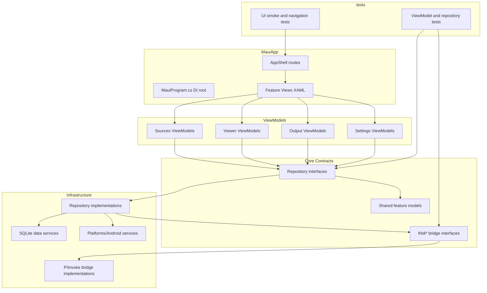
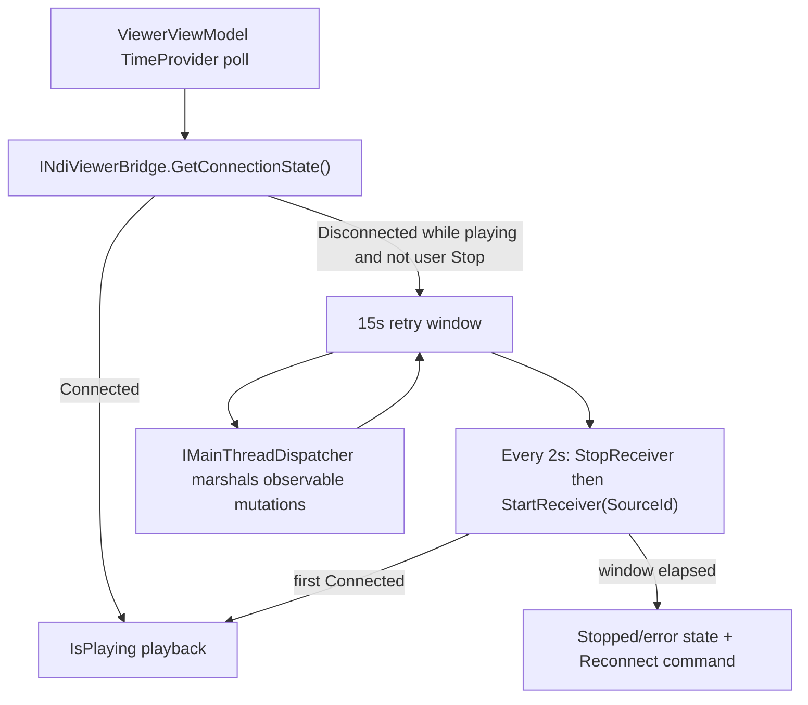

<!-- Last updated: 2026-07-07 -->

# Architecture

This guide defines the active MAUI architecture baseline for NDI-for-Android and supersedes legacy Kotlin module descriptions for current feature planning and validation.

## Module Map

| Module or Project | Layer | Responsibility |
|---|---|---|
| `src/MauiApp` | App composition and presentation | MAUI app startup, Shell routing, XAML views, DI root in `MauiProgram.cs` |
| `src/Core` | Domain and shared contracts | Feature models, repository interfaces, NDI bridge contracts, cross-feature services |
| `src/MauiApp/Features/Home` | Feature presentation + app orchestration | Home dashboard: discovery/viewer/output status summary, quick navigation |
| `src/MauiApp/Features/Sources` | Feature presentation + app orchestration | Source discovery UI, source selection state, route initiation, two-pane embedded viewer on Expanded windows |
| `src/MauiApp/Features/Viewer` | Feature presentation + app orchestration | Viewer session lifecycle, playback UI, reusable `ViewerView` SkiaSharp render surface |
| `src/MauiApp/Features/Output` | Feature presentation + app orchestration | Output initiation (screen share / camera / microphone), output session state, output configuration persistence |
| `src/MauiApp/Features/Settings` | Feature presentation + app orchestration | Settings persistence UI, diagnostics toggles, server config |
| `src/Core/Features/Navigation` | Cross-feature navigation services | `WindowSizeClassService`, `NavigationPolicyService`, adaptive shell state, navigation handoff |
| `src/MauiApp/NdiBridge` + `src/Core/NdiBridge` | Native boundary | P/Invoke wrappers (`NdiRuntime`, discovery/viewer/output bridges, interop layer) and plain C# bridge models only |
| `src/MauiApp/Data` | Persistence infrastructure | SQLite-backed repositories and data access services |
| `src/MauiApp/Platforms/Android` | Platform implementation | Android-only lifecycle hooks, permissions, `NsdManager` bootstrap, MediaProjection/Camera2/AudioRecord capture sources, `AudioTrack` playback sink, foreground service |
| `tests/MauiApp.Tests` | Unit and component tests | ViewModel and repository tests with mocked bridge |
| `tests/MauiApp.UITests` | UI smoke and route validation | App launch and navigation flow coverage on emulator/device |

## Dependency Rules

1. Views depend only on ViewModels and XAML binding contracts.
2. ViewModels depend on repository or service interfaces, never concrete data or bridge implementations.
3. Repository implementations can depend on SQLite, Android platform services, and NDI bridge interfaces.
4. `NdiBridge` is the only layer allowed to perform native interop calls.
5. Native NDI SDK types never leave the bridge boundary; only plain C# records/classes cross layers.
6. Android-specific APIs are isolated in `Platforms/Android` services and injected through interfaces.

## Architecture Diagram



## Navigation

Shell URI contracts — bottom TabBar placement:

| Route | Page | Notes |
|---|---|---|
| `//home-tab` | `HomePage` | Home tab — dashboard with discovery/viewer/output status |
| `//stream-tab` | `OutputPage` | Stream tab — outgoing NDI output origination only; no `sourceId` parameter |
| `//view-tab` | `SourceListPage` | View tab — discovery + tap-to-view; two-pane with embedded viewer on Expanded windows |
| `//settings-tab` | `SettingsPage` | Settings tab |
| `viewer?sourceId={id}` | `ViewerPage` | Pushed relative to the current tab; registered via `Routing.RegisterRoute("viewer", typeof(ViewerPage))` in `AppShell.xaml.cs` |
| `diagnostic-log` | `DiagnosticLogPage` | Pushed; registered in `AppShell.xaml.cs` |

Shell URI contracts — left navigation rail placement:

| Route | Page |
|---|---|
| `//home-rail` | `HomePage` |
| `//stream-rail` | `OutputPage` |
| `//view-rail` | `SourceListPage` |
| `//settings-rail` | `SettingsPage` |

Rules:

1. Register non-tab pushed routes in `AppShell.xaml.cs` using `Routing.RegisterRoute`.
2. ViewModels initiate navigation through the injected `INavigationService` abstraction.
3. Route parameters are validated before bridge session creation.
4. `OutputPage` is a top-level tab and does not accept or require a `sourceId` query parameter.
5. Placement-adaptive routing is handled by `AppShell` reading `AdaptiveShellStateViewModel.IsLeftRailNavigationVisible`; rail placement uses `//xxx-rail` routes, bottom-tab placement uses `//xxx-tab` routes.

### Window size classes and navigation placement (#279)

- `IWindowSizeClassService` / `WindowSizeClassService` (`src/Core/Features/Navigation/Services/`) tracks the Material window width size class — **Compact** (< 600dp), **Medium** (600–840dp), **Expanded** (> 840dp). `AppShell.OnSizeAllocated` feeds the window width (device-independent units) into `UpdateFromWidth`, so the `Changed` event is always raised on the UI thread and only on class transitions.
- `INavigationPolicyService` / `NavigationPolicyService` combines size class and device orientation: **left rail when landscape OR Expanded; bottom tabs otherwise.** Compact/Medium portrait phones keep tabs; 10" tablets get the rail in both orientations.
- **Two-pane View tab**: `SourceListPage` (`src/MauiApp/Features/Sources/Views/SourceListPage.xaml.cs`) subscribes to size-class changes and switches to a 2*/3* two-column layout with an embedded `ViewerView` pane on Expanded, collapsing back to a single column otherwise. The pane's render loop is started/stopped with page visibility and size-class transitions.
- `ViewerView` (`src/MauiApp/Features/Viewer/Views/ViewerView.xaml`) is the reusable SkiaSharp render surface shared by `ViewerPage` and the embedded pane: a ~30 fps dispatcher-timer pull loop invalidates the canvas only when the bridge has produced a newer frame, blitting the ARGB `int[]` into a reused `SKBitmap`.

## NDI Bridge

The bridge is a real P/Invoke integration against the bundled **NDI SDK ANDROID 6.3.1.0** (`libndi.so`). See [ndi-sdk-coverage.md](ndi-sdk-coverage.md) for the per-capability status matrix.

Standard bridge pattern:

1. Define discovery/viewer/output bridge interfaces in `src/Core/NdiBridge/INdiBridges.cs`; plain C# models in `src/Core/NdiBridge/NdiBridgeModels.cs` and `QualityProfile.cs`.
2. Implement bridge classes in `src/MauiApp/NdiBridge/` (file split below). All `[DllImport("ndi")]` declarations live in the interop layer only.
3. Bridge events (`ConnectionStateChanged`, `TallyEchoChanged`, `OutputStatusChanged`) are raised on pump/background threads — subscribers marshal to the UI thread (`IMainThreadDispatcher` in Core ViewModels).
4. Stop or transfer active native sessions during route transitions or app suspend events (`INavigationHandoffService`).

### Bridge file layout (`src/MauiApp/NdiBridge/`)

| File | Responsibility |
|---|---|
| `NdiRuntime.cs` | Library lifecycle: platform bootstrap, `ndi-config.v1.json` discovery config, `NDIlib_initialize`/`NDIlib_destroy`, native version reporting, active-handle counting |
| `Interop/NdiNativeMethods.cs` | The complete `[DllImport("ndi")]` surface (all symbols verified in the bundled binary) |
| `Interop/NdiNativeStructs.cs` | Native struct/enum marshaling definitions |
| `NdiDiscoveryBridge.cs` | Dual-mode source discovery (mDNS / discovery server) with a long-lived finder |
| `NdiViewerBridge.cs` | Receiver: video/audio pump threads, latest-frame double buffer, tally, PTZ, stats |
| `NdiOutputBridge.cs` | Sender: capture output (screen/camera + mic) and zero-copy re-stream sessions |
| `NetworkReachability.cs` | TCP reachability probe (2 s timeout) for discovery-server health checks |

### NdiRuntime lifecycle

`NdiRuntime` (singleton) is the only place `NDIlib_initialize`/`NDIlib_destroy` are called:

- Before the first native object is created, `EnsureInitialized()` calls `INdiPlatformBootstrap.EnsureReady()` — on Android this acquires and holds the `NsdManager` system service (`AndroidNsdBootstrap`), which the NDI SDK requires before any NDI object exists — then writes `ndi-config.v1.json` into app data and points the `NDI_CONFIG_DIR` environment variable at it. The library reads its config exactly once, at initialize time.
- Every successful `EnsureInitialized()` registers an **active handle**; bridges pair it with `ReleaseHandle()` when destroying their native object. A discovery-server change (`SetDiscoveryServers`) reinitializes the library immediately when idle, or defers until the last handle is released.
- `EnsureInitialized()` returns `false` instead of throwing when `NDIlib_initialize` fails (non-NEON CPU) or `libndi.so` is missing (x86/x86_64 — the packaged ABIs are `arm64-v8a`/`armeabi-v7a` only). **NDI features soft-disable on such devices; callers must degrade gracefully, never crash.**
- `NativeVersion` exposes the `NDIlib_version()` string, surfaced in Settings → About.

### Capture sources and audio sink (platform boundary)

The output bridge consumes platform capture through Core interfaces (`src/Core/Services/ICaptureSources.cs`, `IAudioPlaybackSink.cs`); Android implementations live in `src/MauiApp/Platforms/Android/Services/`:

| Interface | Android implementation | Notes |
|---|---|---|
| `IVideoCaptureSource` | `AndroidVideoCaptureSource` | Screen via MediaProjection (RGBA_8888 ImageReader) or front/rear camera via Camera2 (YUV_420_888 → NV12). Frames raised on a capture thread; the producer owns and reuses the buffer, so the bridge sends synchronously before the handler returns. |
| `IAudioCaptureSource` | `AndroidMicrophoneCaptureSource` | AudioRecord float PCM, interleaved chunks |
| `IAudioPlaybackSink` | `AndroidAudioPlaybackSink` | AudioTrack float PCM output for received NDI audio |
| `INdiPlatformBootstrap` | `AndroidNsdBootstrap` | Holds `NsdManager` for the SDK's mDNS machinery |

Non-Android targets register `Noop*` implementations (`src/MauiApp/Services/`). Sending runs under `ScreenShareForegroundService` (`foregroundServiceType="mediaProjection|camera|microphone"`, granted types only on API 34+).

### Discovery mode API (`INdiDiscoveryBridge`)

`INdiDiscoveryBridge.SetDiscoveryMode(DiscoveryMode mode, IReadOnlyList<DiscoveryServerEndpoint>? serverEndpoints)` controls which discovery mechanism is active. The concrete `NdiDiscoveryBridge` serializes all operations through a `SemaphoreSlim(1)` guard (`_modeLock`). A **single long-lived finder** (`NDIlib_find_create_v2`) is kept per active mode configuration — the NDI finder accumulates sources across polls, so recreating it per poll would lose that state. A mode switch destroys the finder; it is lazily recreated on the next `DiscoverSourcesAsync`.

| Mode | Behaviour |
|---|---|
| `DiscoveryMode.Mdns` | Zero-config mDNS: empty discovery-server config, `WifiManager.MulticastLock` acquired via `IMulticastLockService` before each poll (mDNS silently times out on Android without it). |
| `DiscoveryMode.DiscoveryServer` | Server list is applied through `NdiRuntime.SetDiscoveryServers` (written to `ndi-config.v1.json` + `NDI_CONFIG_DIR` — the library reads config at initialize time, so the runtime reinitializes when idle or defers until the last handle drops). Server hosts are additionally passed as `p_extra_ips` on the finder. Results are deduplicated by `SourceId`. The multicast lock is released on switch to this mode. |

`DiscoveryMode` enum and `DiscoveryServerEndpoint` record are defined in `src/Core/NdiBridge/NdiBridgeModels.cs`.

`INdiDiscoveryBridge` also exposes `IsDiscoveryServerReachableAsync(host, port)` and `PerformDiscoveryCheckAsync(host, port, correlationId)` for the Settings diagnostics flow.

### IMulticastLockService

`IMulticastLockService` (interface: `src/Core/Services/IMulticastLockService.cs`) abstracts the Android `WifiManager.MulticastLock` required for mDNS multicast reception. `MauiProgram.cs` registers the correct implementation behind a compile-time conditional:

| Build condition | Implementation | Path |
|---|---|---|
| `#if ANDROID` | `AndroidMulticastLockService` — acquires lock tagged `"ndi_mdns"` with `SetReferenceCounted(false)` | `src/MauiApp/Platforms/Android/Services/AndroidMulticastLockService.cs` |
| otherwise | `NoopMulticastLockService` — both methods return `Task.CompletedTask` | `src/MauiApp/Services/NoopMulticastLockService.cs` |

### INdiOutputBridge

`INdiOutputBridge.StartOutputAsync(string streamName, VideoInputKind inputKind, bool captureMicrophone, CancellationToken)` starts an NDI sender advertising this device under `streamName`, fed by the selected video input (`Screen` — includes the MediaProjection consent flow, faulting with `OperationCanceledException` when declined — or `CameraFront`/`CameraRear`) and optionally microphone audio. No remote `sourceId` is required or accepted. The sender is implemented by `NdiOutputBridge` in `src/MauiApp/NdiBridge/NdiOutputBridge.cs`.

The bridge also exposes:

- **Sender status**: `IsOnProgramTally` and `ConnectionCount`, refreshed by a 1 s poll of `NDIlib_send_get_tally`/`NDIlib_send_get_no_connections`; changes raise `OutputStatusChanged` on a background thread.
- **Re-stream**: `StartReStreamFromSourceAsync(sourceId, qualityProfile)` / `StopReStreamAsync` / `IsReStreamActive` — a dedicated receiver+sender pair pumps frames from a remote source into a new sender named `"Re-stream of {sourceId}"`, forwarding the recv-owned native buffer zero-copy. Independent of the viewer bridge's connection.

The last-used output configuration (`PreferredStreamName`, `InputKind`, `CaptureMicrophone`) is persisted via `IOutputConfigurationRepository` (`src/MauiApp/Features/Output/Repositories/OutputConfigurationRepository.cs`).

### INdiViewerBridge connection state

`INdiViewerBridge` exposes connection liveness through a method-style getter consistent with the rest of the contract (`GetLatestFrame()`, `GetMeasuredFps()`, `GetDroppedFramePercent()`, `GetActualResolution()`) plus a change event:

```csharp
ConnectionState GetConnectionState();
event EventHandler<ConnectionState>? ConnectionStateChanged; // raised on the pump thread
```

- `ConnectionState { Connecting, Connected, Disconnected }` is a **plain C# enum** defined in `src/Core/NdiBridge/NdiBridgeModels.cs`, alongside `DiscoveryMode`. No NDI SDK type crosses the bridge boundary (Dependency Rule 5).
- Drop detection is an **internal bridge concern** (originally anticipated in #233, delivered with the real bridge in #277): the video pump in `src/MauiApp/NdiBridge/NdiViewerBridge.cs` demotes `Connected → Connecting` when no video frame has arrived for 3 s, and to `Disconnected` when `NDIlib_recv_get_no_connections` reports 0 after a connection previously existed.
- `ConnectionStateChanged` and `TallyEchoChanged` are raised on the pump thread; the `ViewerViewModel` marshals resulting observable mutations through `IMainThreadDispatcher` and still calls `GetConnectionState()` from its `TimeProvider`-driven state machine, so the ViewModel remains fully testable against `Mock<INdiViewerBridge>` with no native library.
- The viewer bridge runs **two dedicated pump threads** per receiver (video+metadata, audio) with an atomic running flag; thread joins are never performed while holding the state lock, and the latest decoded frame is exposed through a copy-free front/back double buffer.

### Viewer reconnection component (Issue #233)

The 15-second automatic reconnection state machine lives entirely in `ViewerViewModel` (`src/Core/Features/Viewer/ViewModels`), keeping the View a pure XAML binding surface (Dependency Rule 1, "no business logic in Views").

- **Timing** is driven by an injected `TimeProvider` (constructor injection; `TimeProvider.System` registered as a singleton in `MauiProgram.cs`). No wall-clock or `Task.Delay` in testable logic — tests advance a `FakeTimeProvider`.
- **UI-thread marshaling from Core:** the Core project targets plain `net10.0` and does **not** reference MAUI, so `MainThread.BeginInvokeOnMainThread` / `IDispatcher` are **not** available inside `ViewerViewModel`. Timer-callback-driven observable mutations must therefore be marshaled through an **injected main-thread dispatcher abstraction** defined in `src/Core/Services` with a MAUI implementation in `src/MauiApp` registered in `MauiProgram.cs` — following the established platform-abstraction pattern (`INavigationService`, `IMulticastLockService`, `IAppLifecycleService`). A direct `MainThread.*` call in a Core ViewModel is a layering violation.



### DiscoverySettingsOrchestrator

`IDiscoverySettingsOrchestrator` (interface and implementation both in `src/Core/Features/Settings/Services/`) is the bridge between persisted settings and the discovery bridge:

- `ApplyAsync(NdiSettingsSnapshot)` inspects `settings.DiscoveryServers`, filters to enabled entries ordered by `Order`, and calls `_bridge.SetDiscoveryMode()` accordingly.
  - Zero enabled servers → `DiscoveryMode.Mdns`
  - ≥1 enabled server → `DiscoveryMode.DiscoveryServer` with ordered `DiscoveryServerEndpoint` list
- `ActiveMode` property is read by `SourceRepository.DiscoverAsync` and `SourceListViewModel.UpdateDiscoveryModeLabel`.

### Native packaging constraints

- Keep `libndi.so` binaries (NDI SDK 6.3.1) in `src/MauiApp/Platforms/Android/libs/<abi>/`. They are packaged by the .NET for Android **default** `AndroidNativeLibrary` globs — do **not** add an explicit `<AndroidNativeLibrary Include>` in the csproj, it double-adds them (XA4301).
- Supported ABIs: `arm64-v8a` and `armeabi-v7a` per constitution. There is no x86/x86_64 binary — `NdiRuntime` soft-disables NDI features on those ABIs.
- The csproj must keep `<AndroidManifest>Platforms\Android\AndroidManifest.xml</AndroidManifest>` (`src/MauiApp/NdiForAndroid.csproj`). This project does not enable MAUI SingleProject, so without this property the manifest is **silently ignored** and the APK ships with no permissions beyond `INTERNET` — this broke multicast discovery and capture until fixed.

## Data Layer

Persistence architecture:

1. SQLite access remains repository-mediated only.
2. Settings and discovery server configuration are restored on app startup before first discovery run.
3. Async APIs are mandatory for data access and persistence writes.
4. ViewModels never access SQLite directly.

### SourceEntity schema

`SourceEntity` (table `sources`) includes a `DiscoveryMode TEXT NOT NULL DEFAULT 'Mdns'` column added in feature #213. `NdiDatabase.EnsureSourceColumnsAsync()` applies this column via `ALTER TABLE` if it is absent (safe for existing installs — no data is lost).

`NdiDatabase.MarkDiscoveryServerSourcesStaleAsync(IEnumerable<string> currentSourceIds)` sets `IsAvailable = false` on any Discovery Server source whose `SourceId` is not in the current poll result, implementing the soft-delete retention pattern. mDNS sources are excluded and use natural expiry.

## Settings Restoration Notes (Issue #142)

1. Settings baseline now includes General, Appearance, Discovery Servers, Developer Tools, and About sections.
2. Settings persistence schema is additive-only with deterministic fallback defaults for missing or malformed fields.
3. Discovery server runtime endpoint application is orchestrated through `IDiscoverySettingsOrchestrator.ApplyAsync`, which calls `INdiDiscoveryBridge.SetDiscoveryMode` with the active endpoint list.
4. Android-specific settings capabilities (app metadata retrieval) are isolated behind a platform service implementation under `Platforms/Android`.
