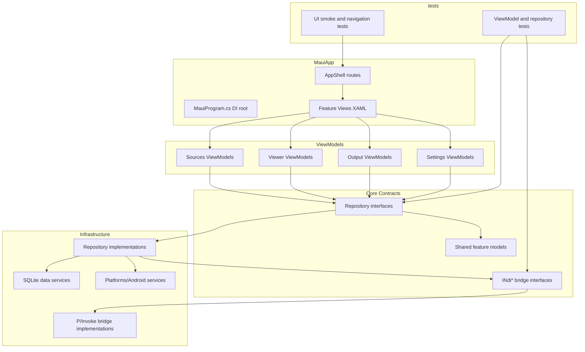

<!-- Last updated: 2026-06-05 -->

# Architecture

This guide defines the active MAUI architecture baseline for NDI-for-Android and supersedes legacy Kotlin module descriptions for current feature planning and validation.

## Module Map

| Module or Project | Layer | Responsibility |
|---|---|---|
| `src/MauiApp` | App composition and presentation | MAUI app startup, Shell routing, XAML views, DI root in `MauiProgram.cs` |
| `src/Core` | Domain and shared contracts | Feature models, repository interfaces, NDI bridge contracts, cross-feature services |
| `src/MauiApp/Features/Sources` | Feature presentation + app orchestration | Source discovery UI, source selection state, route initiation |
| `src/MauiApp/Features/Viewer` | Feature presentation + app orchestration | Viewer session lifecycle and playback UI |
| `src/MauiApp/Features/Output` | Feature presentation + app orchestration | Output and screen-share initiation, output session state |
| `src/MauiApp/Features/Settings` | Feature presentation + app orchestration | Settings persistence UI, diagnostics toggles, server config |
| `src/MauiApp/NdiBridge` + `src/Core/NdiBridge` | Native boundary | P/Invoke wrappers and plain C# bridge models only |
| `src/MauiApp/Data` | Persistence infrastructure | SQLite-backed repositories and data access services |
| `src/MauiApp/Platforms/Android` | Platform implementation | Android-only lifecycle hooks, permissions, MediaProjection and foreground services |
| `tests/MauiApp.Tests` | Unit and component tests | ViewModel and repository tests with mocked bridge |
| `tests/MauiApp.UITests` | UI smoke and route validation | App launch and navigation flow coverage on emulator/device |

## Dependency Rules

1. Views depend only on ViewModels and XAML binding contracts.
2. ViewModels depend on repository or service interfaces, never concrete data or bridge implementations.
3. Repository implementations can depend on SQLite, Android platform services, and NDI bridge interfaces.
4. `NdiBridge` is the only layer allowed to perform native interop calls.
5. Native NDI SDK types never leave the bridge boundary; only plain C# records/classes cross layers.
6. Android-specific APIs are isolated in `Platforms/Android` services and injected through interfaces.

## Architecture Diagram

## Navigation

Shell URI contracts:

- `//sources`
- `//sources/viewer?sourceId={id}`
- `//sources/output?sourceId={id}`
- `//settings`

Rules:

1. Register routes in `AppShell.xaml.cs` using `Routing.RegisterRoute`.
2. ViewModels initiate navigation through an injected navigation service abstraction.
3. Route parameters are validated before bridge session creation.

## NDI Bridge

Standard bridge pattern:

1. Define discovery/viewer/output bridge interfaces under shared contracts.
2. Implement bridge classes with `[DllImport("ndi")]` under the MAUI bridge layer.
3. Marshal native callback updates to UI thread with `MainThread.BeginInvokeOnMainThread`.
4. Stop or transfer active native sessions during route transitions or app suspend events.

Native packaging constraints:

- Keep `libndi.so` binaries in Android-native library paths and include them as `AndroidNativeLibrary` items.
- Support `arm64-v8a` and `armeabi-v7a` assets per constitution.

## Data Layer

Persistence architecture:

1. SQLite access remains repository-mediated only.
2. Settings and discovery server configuration are restored on app startup before first discovery run.
3. Async APIs are mandatory for data access and persistence writes.
4. ViewModels never access SQLite directly.
