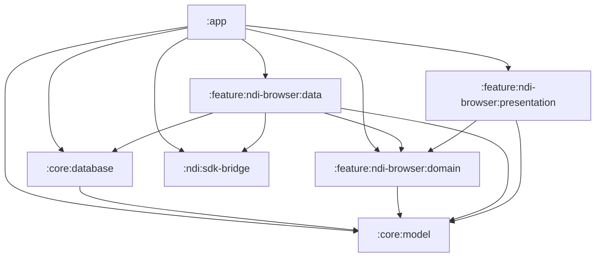
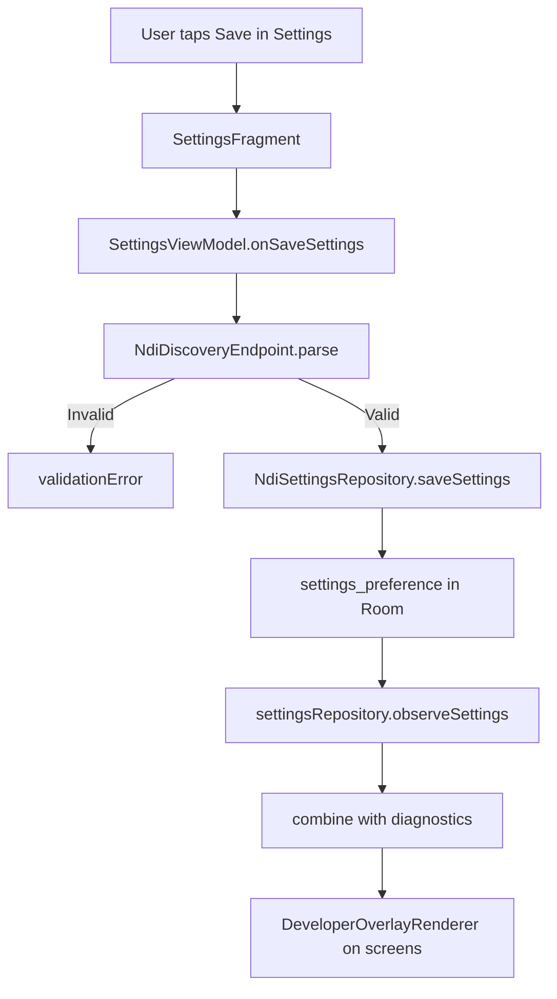

<!-- Last updated: 2026-03-20 -->

# Architecture Guide

This guide describes the implemented architecture for NDI-for-Android, including the spec 006 settings and developer overlay flow.

## Table of Contents

1. [Module Responsibilities](#1-module-responsibilities)
2. [Module Dependency Graph](#2-module-dependency-graph)
3. [Data Flow: Settings Persistence to UI](#3-data-flow-settings-persistence-to-ui)
4. [DI Wiring: AppGraph to Feature Dependencies](#4-di-wiring-appgraph-to-feature-dependencies)
5. [Navigation Contracts](#5-navigation-contracts)
6. [Telemetry Event Flow](#6-telemetry-event-flow)
7. [Lifecycle Safety Rules](#7-lifecycle-safety-rules)

## 1. Module Responsibilities

| Module | Responsibility | Public Surface | Allowed Dependencies |
|---|---|---|---|
| `:app` | Composition root and navigation host | `AppGraph`, `NdiNavigation`, `main_nav_graph.xml` | `:core:*`, `:feature:*`, `:ndi:sdk-bridge` |
| `:core:model` | Shared model and telemetry types | `NdiSettingsModels.kt`, `TelemetryEvent.kt` | None |
| `:core:database` | Room DB, entities, DAOs, migrations | `NdiDatabase`, `SettingsPreferenceDao` | `:core:model` |
| `:core:testing` | Test utilities | test-only helpers | `:core:model` |
| `:feature:ndi-browser:domain` | Repository contracts | `NdiRepositories.kt` interfaces | `:core:model` |
| `:feature:ndi-browser:data` | Repository implementations | `*RepositoryImpl` classes | `:feature:ndi-browser:domain`, `:core:*`, `:ndi:sdk-bridge` |
| `:feature:ndi-browser:presentation` | Fragments, screens, ViewModels, dependency locators | `SettingsFragment`, `SettingsViewModel`, `SourceListFragment`, overlay components | `:feature:ndi-browser:domain`, `:core:model` |
| `:ndi:sdk-bridge` | Native bridge boundary (JNI/C++) | `NativeNdiBridge`, discovery/viewer/output interfaces | `:core:model` |

## 2. Module Dependency Graph



## 3. Data Flow: Settings Persistence to UI

Implemented settings persistence path:

1. `SettingsFragment` dispatches user intents to `SettingsViewModel`.
2. `SettingsViewModel` validates discovery input via `NdiDiscoveryEndpoint.parse`.
3. `NdiSettingsRepositoryImpl` saves `NdiSettingsSnapshot` into Room (`settings_preference`).
4. `AppGraph` combines `settingsRepository.observeSettings()` with diagnostics state.
5. Overlay display state is mapped and consumed by Source/Viewer/Output screens.



Current implementation note:

- Discovery endpoint persistence and parsing are implemented.
- Runtime bridge reconfiguration from saved discovery endpoint is not currently wired into `NdiDiscoveryRepositoryImpl`.

## 4. DI Wiring: AppGraph to Feature Dependencies

`AppGraph` creates repositories and wires service-locator dependency objects:

- `SourceListDependencies`
- `ViewerDependencies`
- `OutputDependencies`
- `SettingsDependencies`

Implemented pattern excerpt:

```kotlin
SettingsDependencies.settingsRepositoryProvider = { settingsRepository }
SettingsDependencies.developerDiagnosticsRepositoryProvider = { developerDiagnosticsRepository }
SettingsDependencies.overlayStateProvider = { overlayDisplayStateFlow }

SourceListDependencies.overlayStateProvider = { overlayDisplayStateFlow }
ViewerDependencies.overlayStateProvider = { overlayDisplayStateFlow }
OutputDependencies.overlayStateProvider = { overlayDisplayStateFlow }
```

## 5. Navigation Contracts

Deep links defined in `app/src/main/res/navigation/main_nav_graph.xml`:

- `ndi://viewer/{sourceId}` with string `sourceId`
- `ndi://output/{sourceId}` with string `sourceId`
- `ndi://settings`

Helpers in `app/src/main/java/com/ndi/app/navigation/NdiNavigation.kt`:

- `viewerRequest(sourceId)`
- `outputRequest(sourceId)`
- `settingsRequest()`

## 6. Telemetry Event Flow

Settings and overlay telemetry path:

1. Settings actions emit via `SettingsDependencies.telemetryEmitter`.
2. Event factories are centralized in `SettingsTelemetry`.
3. `AppGraph` emits overlay transition and redaction events while mapping overlay state.

Main events in the implemented flow:

- `settings_opened`, `settings_closed`
- `discovery_server_saved`
- `developer_mode_toggled`
- `developer_overlay_state_changed`
- `overlay_log_redaction_applied`

## 7. Lifecycle Safety Rules

Implemented lifecycle patterns to keep UI safe:

- `repeatOnLifecycle(Lifecycle.State.STARTED)` for flow collection in screen fragments.
- View bindings are nulled in `onDestroyView`.
- Source List foreground refresh starts in `onStart` and stops in `onStop`.
- Overlay rendering is pure render-time logic and driven by state.
