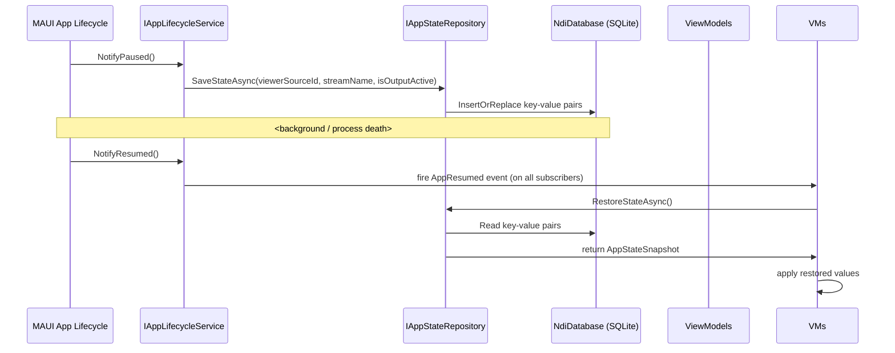

# Feature Plan: Restore Viewer and Output State on App Resume (Issue #234)

## Overview

When the Android app returns from background (including process death), automatically restore the last known viewer source, output session state, and selected source list position. State is persisted to SQLite so it survives process death. The `AppLifecycleService.AppResumed` event triggers restoration via a new `IAppStateRepository`.

## Requirements

### AC1: Last Active Viewer Source Restored
- When returning to foreground, if the viewer was actively playing (IsPlaying = true), automatically set `SourceId` to the last viewed source and show reconnect status.
- Persistence: save on every successful Start, restore on AppResumed.

### AC2: Active Output Session Survives Backgrounding
- On resume, if `IsOutputActive` was true before background, check stream bridge state and re-attach UI (set IsOutputActive = true, update StatusMessage).
- The foreground service keeps the actual NDI stream alive; MAUI app just re-syncs its UI.
- Persistence: save on StartOutput, restore on AppResumed.

### AC3: Last Selected Source Remembered
- Save the last selected source in `SourceListViewModel` when navigating to viewer.
- On resume, if returning to Home/View tab, highlight the previously selected source.

### AC4: State Persists Through Process Death
- All state saved to SQLite via `NdiDatabase`.
- Use key-value pattern (single row per app-state key) for minimal schema impact.

## Architecture Design



### Components

| Component | File | Type | Responsibility |
|-----------|------|------|---------------|
| `AppStateSnapshot` | `Core/Features/AppState/Models/AppStateSnapshot.cs` | record | Immutable DTO carrying all persisted state |
| `IAppStateRepository` | `Core/Features/AppState/Repositories/IAppStateRepository.cs` | interface | SaveAsync / RestoreStateAsync |
| `AppStateEntity` | (inline in `NdiDatabase.cs`) | [Table] | SQLite key-value table |
| `AppStateRepository` | `MauiApp/Features/AppState/Repositories/AppStateRepository.cs` | class | Implements IAppStateRepository using NdiDatabase |
| Lifecycle wiring | `AppLifecycleService.cs` | change | Fire AppResumed on NotifyResumed |
| ViewerViewModel | `Core/Features/Viewer/ViewModels/ViewerViewModel.cs` | change | Subscribe to AppResumed, auto-restore SourceId if was playing |
| OutputViewModel | `Core/Features/Output/ViewModels/OutputViewModel.cs` | change | Subscribe to AppResumed, re-attach UI if was active |
| SourceListViewModel | `Core/Features/Sources/ViewModels/SourceListViewModel.cs` | change | Save last selected source on NavigateToViewerAsync |
| MauiProgram.cs | `MauiApp/MauiProgram.cs` | change | Register IAppStateRepository, wire lifecycle subscribers |

## Persistence Schema

Add to `NdiDatabase.cs`:

```csharp
[Table("app_state")]
public class AppStateEntity {
    [PrimaryKey] public string Key { get; set; } = string.Empty;
    public string Value { get; set; } = string.Empty;
}
```

Keys:
- `"lastViewerSourceId"` — source ID being viewed (may be null → empty string)
- `"streamName"` — current stream name (persisted for resilience, already has StreamName in OutputViewModel)
- `"isOutputActive"` — whether output session was active ("true"/"false")

## Implementation Tasks

### T001: Create AppStateSnapshot record + IAppStateRepository interface (Core)
- File: `src/Core/Features/AppState/Models/AppStateSnapshot.cs`
- Immutable record with properties for all persisted fields

### T002: Implement AppStateRepository using NdiDatabase (MauiApp)
- File: `src/MauiApp/Features/AppState/Repositories/AppStateRepository.cs`
- Save/restore via InsertOrReplace + query on `"app_state"` table
- Ensure table created in InitAsync

### T003: Add AppStateEntity to NdiDatabase (MauiApp)
- File: `src/MauiApp/Data/NdiDatabase.cs` (modify)
- Add AppStateEntity class, EnsureAppStateTable method, Save/Get methods for key-value pairs

### T004: Wire into AppLifecycleService + MauiProgram DI
- File: `src/MauiApp/MauiProgram.cs` (modify)
- Register IAppStateRepository as Singleton
- Subscribe to AppResumed events in lifecycle service

### T005: Auto-restore viewer state in ViewerViewModel on resume
- File: `src/Core/Features/Viewer/ViewModels/ViewerViewModel.cs` (modify)
- Inject IAppStateRepository, subscribe to AppResumed, auto-restore if wasPlaying=true

### T006: Re-attach output session in OutputViewModel on resume
- File: `src/Core/Features/Output/ViewModels/OutputViewModel.cs` (modify)
- Inject IAppStateRepository + IAppLifecycleService, re-attach UI on AppResumed

### T007: Track last selected source in SourceListViewModel
- File: `src/Core/Features/Sources/ViewModels/SourceListViewModel.cs` (modify)
- Add LastSelectedSourceId property, save it via IAppStateRepository on navigation

### T008: Add unit tests for AppStateRepository + lifecycle integration
- File: `tests/MauiApp.Tests/Features/AppState/AppStateRepositoryTests.cs`
- Tests: save and restore, process death recovery, missing keys fallback

## Success Criteria

| AC | Verification |
|----|-------------|
| Last viewer source restored | Unit test: ViewerViewModel auto-restores SourceId on AppResumed when wasPlaying=true |
| Output session survives | Device test: start output → background app → resume → UI shows IsOutputActive=true |
| Selected source remembered | Unit test: SourceListViewModel saves last selected source ID to repository |
| State persists through death | Integration test: save state → simulate missing DB → restore should return null-safe defaults |
