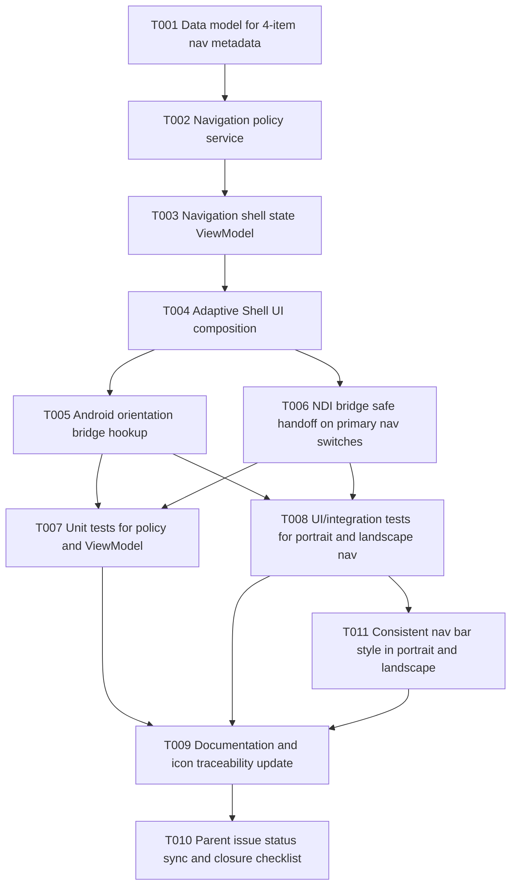

# Tasks: Restore Legacy Adaptive Navigation Parity

## Summary
- Parent issue: #141
- Total tasks: 11
- Layers covered: Data, Repository/Service, ViewModel, View/XAML, Platform/Android, NDI Bridge, Unit Test, UI/Integration Test, Docs, Issue Ops
- Branch: bugfix/141-fix-broken-navigation-flows

## Dependency Graph



Text form:

```
T001 -> T002
T002 -> T003
T003 -> T004
T004 -> T005, T006
T005, T006 -> T007, T008
T008 -> T011
T007, T008, T011 -> T009
T009 -> T010
```

## Task List

### T001: Add primary navigation metadata model for legacy parity
- **Layer**: Data
- **Description**: Introduce a navigation metadata model in Core (for example a `PrimaryNavItem` type) that defines the four authoritative entries (`Home`, `Stream`, `View`, `Settings`) plus icon-key references used by MAUI UI composition and tests.
- **Depends on**: none
- **Acceptance**: A compile-time navigation model exists that enumerates exactly four primary items and their icon keys.
- **GitHub issue**: #169

### T002: Implement orientation-aware navigation policy service
- **Layer**: Repository / Service
- **Description**: Add a service that resolves navigation placement mode (`Bottom` for portrait, `LeftRail` for landscape) and publishes deterministic shell policy from device display/orientation state.
- **Depends on**: T001
- **Acceptance**: Service returns bottom placement in portrait and left placement in landscape with unit-testable API.
- **GitHub issue**: #170

### T003: Build adaptive shell state ViewModel for 4-item navigation
- **Layer**: ViewModel
- **Description**: Create or refactor shell/navigation ViewModel state to consume T001/T002 and expose selected item, visible item list, and item-to-route mapping for Home/Stream/View/Settings.
- **Depends on**: T002
- **Acceptance**: ViewModel exposes four primary items and route targets for each item with no hard-coded UI branching in XAML code-behind.
- **GitHub issue**: #171

### T004: Refactor AppShell UI to adaptive left/bottom navigation layout
- **Layer**: View / XAML
- **Description**: Replace the current two-item shell composition with adaptive MAUI UI that renders navigation at bottom in portrait and left in landscape, including all four primary entries and route wiring to corresponding pages.
- **Depends on**: T003
- **Acceptance**: AppShell renders Home/Stream/View/Settings in both orientations with placement switching as specified.
- **GitHub issue**: #172

### T005: Add Android configuration-change bridge for orientation updates
- **Layer**: Platform
- **Description**: Wire Android-specific orientation/configuration notifications (under `Platforms/Android`) into the navigation policy service so layout mode updates immediately after rotation without app restart.
- **Depends on**: T004
- **Acceptance**: Rotating the device updates navigation placement live between bottom and left.
- **GitHub issue**: #173

### T006: Enforce NDI-safe primary navigation handoff behavior
- **Layer**: NDI Bridge
- **Description**: Ensure primary navigation transitions (`Stream` <-> `View` and exits to Home/Settings) coordinate correctly with existing NDI viewer/output bridge lifecycle calls to prevent dangling receiver/output sessions during page switches.
- **Depends on**: T004
- **Acceptance**: No active NDI bridge operation is orphaned when switching between primary navigation destinations.
- **GitHub issue**: #174

### T007: Add unit tests for navigation model, policy, and shell state ViewModel
- **Layer**: Test
- **Description**: Add unit coverage in `tests/MauiApp.Tests` for (a) exact four-item navigation model, (b) portrait/landscape placement resolution, and (c) destination mapping from menu item selection.
- **Depends on**: T005, T006
- **Acceptance**: Unit tests verify four-item parity and orientation policy behavior with passing `dotnet test`.
- **GitHub issue**: #175

### T008: Add UI/integration tests for adaptive menu placement and navigation actions
- **Layer**: Test
- **Description**: Extend `tests/MauiApp.UITests` to verify portrait bottom placement, landscape left placement, icon presence checks, and click-through navigation to Home/Stream/View/Settings pages on emulator/device.
- **Depends on**: T005, T006
- **Acceptance**: UI tests assert both orientation layouts and successful navigation for all four items.
- **GitHub issue**: #176

### T011: Ensure navigation bar style parity across portrait and landscape
- **Layer**: View / XAML
- **Description**: Align visual style and interaction affordances for the primary navigation bar so portrait and landscape present the same look-and-feel, not two unrelated visual systems.
- **Depends on**: T008
- **Acceptance**: Navigation in portrait and landscape has matching icon treatment, label styling, and selection state design.
- **GitHub issue**: #189

### T009: Document legacy icon mapping and navigation parity evidence
- **Layer**: Docs
- **Description**: Update navigation docs and test evidence with an explicit icon-traceability table (`legacy icon reference` -> `MAUI asset`) plus screenshots/logs for portrait and landscape behavior.
- **Depends on**: T007, T008, T011
- **Acceptance**: Documentation includes icon mapping evidence and orientation validation artifacts committed to repo.
- **GitHub issue**: #177

### T010: Sync parent issue completion checklist and sub-issue status
- **Layer**: Issue Update
- **Description**: Post final status summary to #141, ensure all T001-T009 task issues are linked as children to parent #141, and close parent only after PR + CI + validation evidence are present.
- **Depends on**: T009
- **Acceptance**: Parent issue #141 reflects completed child tasks with traceable links and final implementation evidence.
- **GitHub issue**: #178
