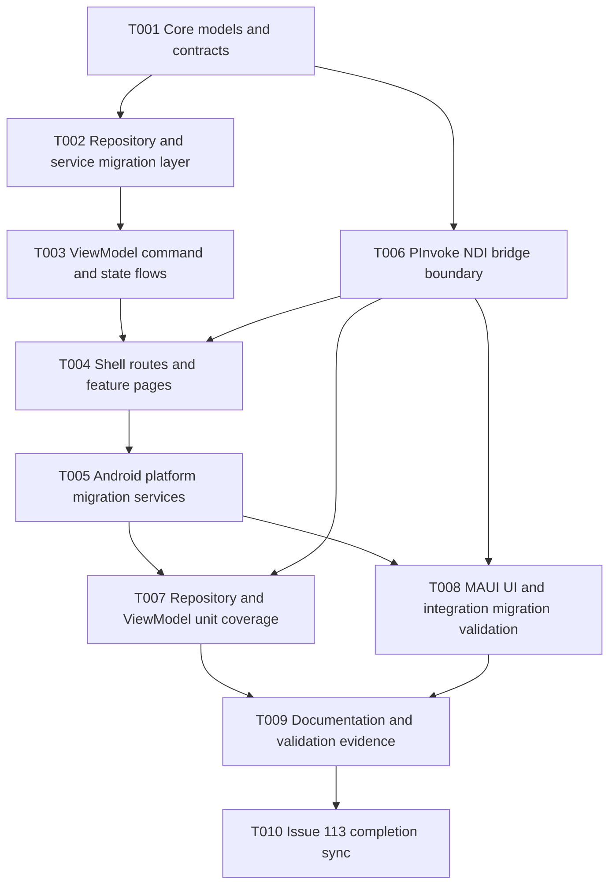

# Tasks: Rewrite NDI-for-Android as .NET MAUI

## Summary
- Total tasks: 10
- Layers covered: Data, Repository/Service, ViewModel, View, Platform, NDI Bridge, Test, Docs, Issue Update
- GitHub issue: #113

## Implementation Status (2026-06-05)
- T001 ✅ Completed
- T002 ✅ Completed
- T003 ✅ Completed
- T004 ✅ Completed
- T005 ✅ Completed
- T006 ✅ Completed
- T007 ✅ Completed
- T008 ✅ Completed
- T009 ✅ Completed
- T010 ✅ Completed

Validation evidence:
- `dotnet test tests/MauiApp.Tests/MauiApp.Tests.csproj` → 14 passed.
- `dotnet test tests/MauiApp.UITests/MauiApp.UITests.csproj` → 4 skipped (expected when `ANDROID_APK_PATH` is not set).
- Solution and Android project compile validation were executed during implementation.

## Dependency Graph



Text form:

```
T001 -> T002, T006
T002 -> T003
T003 -> T004
T006 -> T004
T004 -> T005
T005, T006 -> T007, T008
T007, T008 -> T009
T009 -> T010
```

## Task List

### T001: Port core MAUI migration models and contracts
- **Layer**: Data
- **Description**: Port shared migration models/records and contract types into Core C# so downstream repositories, bridge adapters, and ViewModels no longer rely on Kotlin-era structures.
- **Depends on**: none
- **Acceptance**: Core migration models and contracts are defined in C# and consumed by downstream services without Kotlin dependencies.
- **GitHub issue**: #190

### T002: Implement MAUI repository and service migration layer
- **Layer**: Repository / Service
- **Description**: Implement repository and service abstractions and concrete implementations for migrated feature flows with async operations and DI-ready interfaces.
- **Depends on**: T001
- **Acceptance**: Repository interfaces and implementations provide async discovery/settings/data operations through MAUI services.
- **GitHub issue**: #191

### T003: Implement migrated ViewModel command and state flows
- **Layer**: ViewModel
- **Description**: Build or align CommunityToolkit.Mvvm ViewModels for migrated features with explicit command/state behavior for discovery, viewer, output, and settings.
- **Depends on**: T002
- **Acceptance**: Feature ViewModels expose command/state parity for discovery, viewer, output, and settings workflows.
- **GitHub issue**: #192

### T004: Compose MAUI Shell routes and feature pages
- **Layer**: View
- **Description**: Compose MAUI Shell route structure and feature pages for home/sources, viewer, output, and settings to preserve navigation contracts.
- **Depends on**: T003, T006
- **Acceptance**: Shell routes and feature pages render and navigate correctly for home/sources, viewer, output, and settings.
- **GitHub issue**: #193

### T005: Implement Android platform migration services
- **Layer**: Platform
- **Description**: Implement Android-specific platform services (for example MediaProjection, lifecycle, foreground behavior) under `Platforms/Android` with interface-based wiring.
- **Depends on**: T004
- **Acceptance**: Android lifecycle and platform services (including screen capture and foreground behavior) are wired through platform abstractions.
- **GitHub issue**: #194

### T006: Implement PInvoke NDI bridge migration boundary
- **Layer**: NDI Bridge
- **Description**: Implement and align P/Invoke wrappers and marshaling pipeline in the NDI bridge layer while keeping native types isolated from UI and ViewModels.
- **Depends on**: T001
- **Acceptance**: Discovery/viewer/output bridge operations execute through P/Invoke wrappers with plain C# boundary models only.
- **GitHub issue**: #195

### T007: Add repository and ViewModel unit coverage for migration parity
- **Layer**: Test
- **Description**: Add repository and ViewModel unit tests for migrated behavior, including parity-sensitive command/state paths and error handling.
- **Depends on**: T005, T006
- **Acceptance**: Unit tests cover migrated repository and ViewModel happy/error paths with passing `dotnet test`.
- **GitHub issue**: #196

### T008: Add MAUI UI and integration migration validation tests
- **Layer**: Test
- **Description**: Extend UI and integration tests to validate app launch, route navigation, and primary migrated flows on emulator/device harness.
- **Depends on**: T005, T006
- **Acceptance**: UI/integration tests validate launch, navigation, and primary migration flows on emulator/device harness.
- **GitHub issue**: #197

### T009: Update migration documentation and validation evidence
- **Layer**: Docs
- **Description**: Update migration documentation artifacts with implementation evidence, runbook updates, and operational notes.
- **Depends on**: T007, T008
- **Acceptance**: Migration docs include architecture/runbook/evidence updates that reflect implemented parity and known constraints.
- **GitHub issue**: #198

### T010: Sync issue 113 completion status and closure checklist
- **Layer**: Issue Update
- **Description**: Post final status sync to issue #113, verify child linkage completeness, and track closure gates tied to PR and CI readiness.
- **Depends on**: T009
- **Acceptance**: Parent issue #113 reflects complete child linkage, status summary, and closure readiness gates.
- **GitHub issue**: #199
