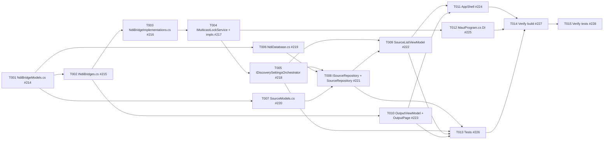

# Tasks: NDI Integration Rework — mDNS Fallback, Discovery Server Sourcing, and View/Stream Screen Separation

<!-- Feature issue: #213 -->
<!-- Branch: feature/213-ndi-integration-rework -->
<!-- Generated: 2026-06-08 -->

---

## Summary

- **Total tasks:** 15
- **Layers covered:** NDI Bridge (Core contracts), NDI Bridge (MauiApp implementation), Platform Services, Repository / Service, Data Layer, Model, ViewModel, View / XAML, Shell / Navigation, DI Registration, Test, CI Verification
- **GitHub parent issue:** [#213](https://github.com/nielsverhoeven/NDI-for-Android/issues/213)

---

## Dependency Graph



**Linear ready-order (no circular dependencies):**
```
T001 → T002, T006, T007
T002 → T003, T010
T003 → T004
T004 → T005, T012
T005 → T008, T009
T006 → T008
T007 → T008
T008 → T009, T013
T009 → T011, T013
T010 → T011, T013
T011 → T014
T012 → T014
T013 → T014
T014 → T015 (final)
```

---

## Task List

### T001: NdiBridgeModels.cs — add DiscoveryMode enum, DiscoveryServerEndpoint record, update NdiSourceEntry
- **Layer:** NDI Bridge (Core — shared contracts)
- **Description:** Modify `src/Core/NdiBridge/NdiBridgeModels.cs` to add the `DiscoveryMode` enum (`Mdns`, `DiscoveryServer`), the `DiscoveryServerEndpoint(string Host, int Port)` record, and a `DiscoveryMode DiscoveryMode` property on `NdiSourceEntry`. These plain C# types form the shared vocabulary used by the bridge interface, implementation, and domain model layers throughout this feature.
- **Depends on:** none
- **Acceptance:** `NdiBridgeModels.cs` compiles with no errors, contains `DiscoveryMode` enum, `DiscoveryServerEndpoint` record, and `NdiSourceEntry` carries a `DiscoveryMode` property; `dotnet build` passes on the Core project.
- **GitHub issue:** [#214](https://github.com/nielsverhoeven/NDI-for-Android/issues/214)

---

### T002: INdiBridges.cs — replace SetDiscoveryEndpoint with SetDiscoveryMode; simplify INdiOutputBridge
- **Layer:** NDI Bridge (Core — shared contracts)
- **Description:** Modify `src/Core/NdiBridge/INdiBridges.cs`. On `INdiDiscoveryBridge`: replace `void SetDiscoveryEndpoint(string? host, int? port)` with `void SetDiscoveryMode(DiscoveryMode mode, IReadOnlyList<DiscoveryServerEndpoint>? serverEndpoints = null)`. On `INdiOutputBridge`: replace `Task StartOutputAsync(string sourceId, string streamName, CancellationToken)` with `Task StartOutputAsync(string streamName, CancellationToken)`; remove `Task<bool> IsSourceReachableAsync(string sourceId, CancellationToken)`. These interface changes define the new bridge contract consumed by the orchestrator and ViewModel layers.
- **Depends on:** [#214](https://github.com/nielsverhoeven/NDI-for-Android/issues/214) (T001)
- **Acceptance:** `INdiBridges.cs` compiles; `SetDiscoveryMode` signature matches the plan specification; `IsSourceReachableAsync` is absent from `INdiOutputBridge`; `dotnet build` on Core passes.
- **GitHub issue:** [#215](https://github.com/nielsverhoeven/NDI-for-Android/issues/215)

---

### T003: NdiBridgeImplementations.cs — implement SetDiscoveryMode, DiscoverViaMdnsAsync, DiscoverViaServersAsync; update NdiOutputBridge
- **Layer:** NDI Bridge (MauiApp — platform implementations)
- **Description:** Modify `src/MauiApp/NdiBridge/NdiBridgeImplementations.cs`. Replace `_discoveryHost`/`_discoveryPort` fields with `_activeMode` and `_serverEndpoints`. Implement `SetDiscoveryMode` with a `SemaphoreSlim(1)` thread-safety guard. Add `DiscoverViaMdnsAsync()` (calls `NDIlib_find_create_v3` with no server address, or Android `NsdManager` fallback; acquires `IMulticastLockService` before starting). Add `DiscoverViaServersAsync()` (iterates endpoints, performs TCP reachability, queries each server, merges and deduplicates results by display name with first-server-wins ordering). Tag all returned `NdiSourceEntry` results with the correct `DiscoveryMode`. Update `NdiOutputBridge.StartOutputAsync` to the simplified `streamName`-only signature; remove `IsSourceReachableAsync` implementation.
- **Depends on:** [#215](https://github.com/nielsverhoeven/NDI-for-Android/issues/215) (T002)
- **Acceptance:** `NdiBridgeImplementations.cs` compiles; both `DiscoverViaMdnsAsync` and `DiscoverViaServersAsync` methods exist; `SetDiscoveryMode` is thread-safe (semaphore guard present); `NdiOutputBridge.StartOutputAsync` accepts only `streamName`; `dotnet build` passes.
- **GitHub issue:** [#216](https://github.com/nielsverhoeven/NDI-for-Android/issues/216)

---

### T004: Create IMulticastLockService, AndroidMulticastLockService, and NoopMulticastLockService
- **Layer:** Platform Services
- **Description:** Create three new files to provide a `WifiManager.MulticastLock` abstraction: (1) `src/Core/Services/IMulticastLockService.cs` — interface with `Task AcquireAsync(CancellationToken ct)` and `Task ReleaseAsync(CancellationToken ct)`; (2) `src/MauiApp/Platforms/Android/Services/AndroidMulticastLockService.cs` — Android implementation that acquires/releases `WifiManager.MulticastLock` tagged `"ndi_mdns"`, compatible with API 26–35, no new manifest permissions required; (3) `src/MauiApp/Services/NoopMulticastLockService.cs` — no-op implementation for non-Android build targets. These are consumed by `NdiDiscoveryBridge` (T003) and registered in DI (T012).
- **Depends on:** [#216](https://github.com/nielsverhoeven/NDI-for-Android/issues/216) (T003)
- **Acceptance:** All three files compile; `IMulticastLockService` is in `src/Core/Services/`; Android implementation is under `Platforms/Android/`; noop is in `src/MauiApp/Services/`; `dotnet build` passes.
- **GitHub issue:** [#217](https://github.com/nielsverhoeven/NDI-for-Android/issues/217)

---

### T005: IDiscoverySettingsOrchestrator — add ActiveMode; DiscoverySettingsOrchestrator — full multi-server + mDNS logic
- **Layer:** Repository / Service (Settings / Orchestration)
- **Description:** Modify `src/Core/Features/Settings/Services/IDiscoverySettingsOrchestrator.cs` to add `DiscoveryMode ActiveMode { get; }`. Modify `src/MauiApp/Features/Settings/Services/DiscoverySettingsOrchestrator.cs` to implement full orchestration logic: `ResolveMode(settings)` returns `Mdns` when `DiscoveryServers` is empty or all disabled, `DiscoveryServer` otherwise; `ApplyAsync(settings)` calls `bridge.SetDiscoveryMode(Mdns)` or `bridge.SetDiscoveryMode(DiscoveryServer, endpoints)` with all enabled endpoints ordered by `Order`; `ActiveMode` is updated after each apply. Legacy `DiscoveryHost`/`DiscoveryPort` fields are ignored (retained in DB schema only for backward compatibility).
- **Depends on:** [#217](https://github.com/nielsverhoeven/NDI-for-Android/issues/217) (T004)
- **Acceptance:** `IDiscoverySettingsOrchestrator` exposes `ActiveMode`; `DiscoverySettingsOrchestrator.ApplyAsync` calls the correct `SetDiscoveryMode` overload; no reference to the legacy `SetDiscoveryEndpoint`; `dotnet build` passes.
- **GitHub issue:** [#218](https://github.com/nielsverhoeven/NDI-for-Android/issues/218)

---

### T006: NdiDatabase.cs — add DiscoveryMode column, migration, and MarkDiscoveryServerSourcesStaleAsync
- **Layer:** Data Layer
- **Description:** Modify `src/MauiApp/Data/NdiDatabase.cs`. Add `public string DiscoveryMode { get; set; } = "Mdns";` column to `SourceEntity`. Add an idempotent `ALTER TABLE` migration in `EnsureSettingsColumnsAsync` (guarded by `if (!columnNames.Contains("DiscoveryMode"))`). Add `Task MarkDiscoveryServerSourcesStaleAsync(IEnumerable<string> currentSourceIds)` which sets `IsAvailable = false` for all Discovery Server rows whose `SourceId` is NOT in `currentSourceIds`; mDNS sources are excluded from soft-delete. All DB calls must use the async SQLite API throughout.
- **Depends on:** [#214](https://github.com/nielsverhoeven/NDI-for-Android/issues/214) (T001)
- **Acceptance:** `SourceEntity` has a `DiscoveryMode` string property; migration is guarded and idempotent; `MarkDiscoveryServerSourcesStaleAsync` updates only Discovery Server rows; all DB calls are async; `dotnet build` passes.
- **GitHub issue:** [#219](https://github.com/nielsverhoeven/NDI-for-Android/issues/219)

---

### T007: SourceModels.cs — add DiscoveryMode property to NdiSource record
- **Layer:** Model (Sources feature domain)
- **Description:** Modify `src/Core/Features/Sources/Models/SourceModels.cs` to add a `NdiBridge.DiscoveryMode DiscoveryMode = NdiBridge.DiscoveryMode.Mdns` positional parameter (with default) to the `NdiSource` record. `NdiBridge.DiscoveryMode` is a plain C# enum defined in Core — not an NDI SDK type — so crossing the bridge boundary into the Sources domain model is permitted per the constitution (§2.1). Existing callers that omit the parameter must continue to compile without changes.
- **Depends on:** [#214](https://github.com/nielsverhoeven/NDI-for-Android/issues/214) (T001)
- **Acceptance:** `NdiSource` record compiles with the new `DiscoveryMode` property; default value is `Mdns`; existing call sites that omit the parameter still compile; `dotnet build` passes.
- **GitHub issue:** [#220](https://github.com/nielsverhoeven/NDI-for-Android/issues/220)

---

### T008: ISourceRepository + SourceRepository — mode tagging and stale source soft-delete
- **Layer:** Repository / Service (Sources)
- **Description:** Modify `src/Core/Features/Sources/Repositories/ISourceRepository.cs` to add `Task<NdiBridge.DiscoveryMode> GetActiveDiscoveryModeAsync()`. Modify `src/MauiApp/Features/Sources/Repositories/SourceRepository.cs` to: tag each upserted `NdiSource` with the `DiscoveryMode` returned from the bridge/orchestrator; after a successful Discovery Server poll call `db.MarkDiscoveryServerSourcesStaleAsync(currentSourceIds)` to soft-delete sources that no longer appear; implement `GetActiveDiscoveryModeAsync()` by delegating to `IDiscoverySettingsOrchestrator.ActiveMode`. mDNS sources use natural expiry and are excluded from stale soft-delete.
- **Depends on:** [#218](https://github.com/nielsverhoeven/NDI-for-Android/issues/218) (T005), [#219](https://github.com/nielsverhoeven/NDI-for-Android/issues/219) (T006), [#220](https://github.com/nielsverhoeven/NDI-for-Android/issues/220) (T007)
- **Acceptance:** `ISourceRepository` declares `GetActiveDiscoveryModeAsync`; `SourceRepository` tags sources with mode; stale soft-delete is called only after Discovery Server polls; `dotnet build` passes.
- **GitHub issue:** [#221](https://github.com/nielsverhoeven/NDI-for-Android/issues/221)

---

### T009: SourceListViewModel.cs — add ActiveDiscoveryModeLabel, StopDiscoveryCommand; remove NavigateToOutputAsync
- **Layer:** ViewModel (Sources)
- **Description:** Modify `src/Core/Features/Sources/ViewModels/SourceListViewModel.cs`. Inject `IDiscoverySettingsOrchestrator` into the constructor. Add `[ObservableProperty] private string _activeDiscoveryModeLabel` populated after each successful `DiscoverAsync` call (value: `"mDNS"` for Mdns mode; `"Discovery Server: host:port"` for DiscoveryServer showing the primary endpoint). Add `StopDiscoveryCommand` (`[RelayCommand]`) called from `SourceListPage.OnDisappearing` to stop background discovery and release the MulticastLock. Remove `NavigateToOutputAsync` command and its `[RelayCommand]` attribute — the Stream screen is self-contained. Optionally add a periodic refresh `CancellationTokenSource` (≥3 s interval) for continuous mDNS discovery while active.
- **Depends on:** [#218](https://github.com/nielsverhoeven/NDI-for-Android/issues/218) (T005), [#221](https://github.com/nielsverhoeven/NDI-for-Android/issues/221) (T008)
- **Acceptance:** `SourceListViewModel` compiles with `ActiveDiscoveryModeLabel` and `StopDiscoveryCommand`; `NavigateToOutputAsync` is absent; orchestrator is injected; `dotnet build` passes.
- **GitHub issue:** [#222](https://github.com/nielsverhoeven/NDI-for-Android/issues/222)

---

### T010: OutputViewModel + OutputPage — remove SourceId, add StreamName, fix status message
- **Layer:** ViewModel + View (Output)
- **Description:** Make the Stream/Output screen self-contained. Modify `src/Core/Features/Output/ViewModels/OutputViewModel.cs`: remove `[ObservableProperty] private string? _sourceId`; add `[ObservableProperty] private string _streamName = "NDI-Android"`; update `StartOutputCommand` to call `bridge.StartOutputAsync(StreamName, ct)` without reachability pre-check; remove the "Select a source on Home before starting output." status message. Modify `src/MauiApp/Features/Output/Views/OutputPage.xaml.cs`: remove `[QueryProperty(nameof(SourceId), "sourceId")]` attribute and `SourceId` property setter. Modify `src/MauiApp/Features/Output/Views/OutputPage.xaml`: add an `Entry` bound to `StreamName`; remove all source-related display elements.
- **Depends on:** [#215](https://github.com/nielsverhoeven/NDI-for-Android/issues/215) (T002)
- **Acceptance:** `OutputViewModel` has `StreamName` and no `SourceId`; `OutputPage.xaml.cs` has no `QueryProperty` for `sourceId`; XAML has a `StreamName` entry and no source list elements; `dotnet build` passes.
- **GitHub issue:** [#223](https://github.com/nielsverhoeven/NDI-for-Android/issues/223)

---

### T011: AppShell.xaml + AppShell.xaml.cs — reassign View tab to SourceListPage; remove sourceId output route
- **Layer:** View / Shell (Navigation)
- **Description:** Modify `src/MauiApp/AppShell.xaml` to swap the View FlyoutItem and TabBar `ShellContent` `ContentTemplate` from `ViewerPage` to `SourceListPage` (both `view-rail` and `view-tab` entries). `ViewerPage` remains registered via `Routing.RegisterRoute("viewer", typeof(ViewerPage))` for modal push from the source list. Modify `src/MauiApp/AppShell.xaml.cs` to remove `Routing.RegisterRoute("output", typeof(OutputPage))` (or retain as no-op since `OutputPage` is now a top-level tab); remove any `GoToAsync("output?sourceId=...")` calls; verify `ParseDestination` still maps `//view-rail`/`//view-tab` correctly to `PrimaryNavDestination.View` after the template swap.
- **Depends on:** [#222](https://github.com/nielsverhoeven/NDI-for-Android/issues/222) (T009), [#223](https://github.com/nielsverhoeven/NDI-for-Android/issues/223) (T010)
- **Acceptance:** View tab opens `SourceListPage`; Stream tab opens `OutputPage` with no `sourceId` query param; `Routing.RegisterRoute("viewer")` still present; no `GoToAsync` call passes `sourceId` to Output; `dotnet build` passes.
- **GitHub issue:** [#224](https://github.com/nielsverhoeven/NDI-for-Android/issues/224)

---

### T012: MauiProgram.cs — register IMulticastLockService (Android / noop) in DI
- **Layer:** Platform (DI Registration)
- **Description:** Modify `src/MauiApp/MauiProgram.cs` to register `IMulticastLockService` with the correct platform-specific implementation using a conditional compilation guard: `AndroidMulticastLockService` under `#if ANDROID`, `NoopMulticastLockService` otherwise. Verify that `IDiscoverySettingsOrchestrator` is already available for injection into `SourceListViewModel` — no other DI changes are required and existing singletons/transients must remain unchanged.
- **Depends on:** [#217](https://github.com/nielsverhoeven/NDI-for-Android/issues/217) (T004)
- **Acceptance:** `MauiProgram.cs` registers `IMulticastLockService` behind the `#if ANDROID` guard; `dotnet build -f net10.0-android` resolves `AndroidMulticastLockService`; non-Android build resolves `NoopMulticastLockService`; `dotnet build` passes.
- **GitHub issue:** [#225](https://github.com/nielsverhoeven/NDI-for-Android/issues/225)

---

### T013: Tests — update SourceListViewModelTests, OutputViewModelTests; create SourceRepositoryTests, DiscoverySettingsOrchestratorTests, NdiDiscoveryBridgeTests
- **Layer:** Test
- **Description:** Update and create test files to cover all modified behaviour. No test may touch `libndi.so` — all use mock bridge. **Modify** `tests/MauiApp.Tests/Features/Sources/SourceListViewModelTests.cs`: add `IDiscoverySettingsOrchestrator` mock; add tests for `ActiveDiscoveryModeLabel` (both mode paths); add `StopDiscoveryCommand` test; remove `NavigateToOutputAsync` test. **Modify** `tests/MauiApp.Tests/Features/Output/OutputViewModelTests.cs`: remove `SourceId` from all tests; add `StreamName` happy-path and empty-string error tests; update `StartOutputAsync` mock; remove reachability mock setup. **Create** `tests/MauiApp.Tests/Features/Sources/SourceRepositoryTests.cs`: happy/error for mDNS mode; happy/error for Discovery Server mode; stale soft-delete verification; `DiscoveryMode` tag written correctly. **Create** `tests/MauiApp.Tests/Features/Settings/DiscoverySettingsOrchestratorTests.cs`: no-servers → `SetDiscoveryMode(Mdns)`; ≥1 enabled → `SetDiscoveryMode(DiscoveryServer, endpoints)`; hot-switch test. **Create** `tests/MauiApp.Tests/NdiBridge/NdiDiscoveryBridgeTests.cs`: mDNS mode path; two-server merge + deduplication; mode-switch mutual exclusivity; unreachable server returns empty list without throwing.
- **Depends on:** [#218](https://github.com/nielsverhoeven/NDI-for-Android/issues/218) (T005), [#221](https://github.com/nielsverhoeven/NDI-for-Android/issues/221) (T008), [#222](https://github.com/nielsverhoeven/NDI-for-Android/issues/222) (T009), [#223](https://github.com/nielsverhoeven/NDI-for-Android/issues/223) (T010)
- **Acceptance:** All five test files compile; every new public method has at least one happy-path and one error-path test; `dotnet test tests/MauiApp.Tests` exits 0.
- **GitHub issue:** [#226](https://github.com/nielsverhoeven/NDI-for-Android/issues/226)

---

### T014: Verify build — dotnet build src/NdiForAndroid.sln passes with zero errors
- **Layer:** CI Verification
- **Description:** Run `dotnet build src/NdiForAndroid.sln -f net10.0-android -c Debug` and confirm it exits with zero errors and zero new warnings compared to the pre-feature baseline. This is a gate task — no further work proceeds if the build is red. Satisfies the constitution (§4.1): "dotnet build must pass after every task." This is the explicit final check after all code tasks (T001–T013) are merged.
- **Depends on:** [#224](https://github.com/nielsverhoeven/NDI-for-Android/issues/224) (T011), [#225](https://github.com/nielsverhoeven/NDI-for-Android/issues/225) (T012), [#226](https://github.com/nielsverhoeven/NDI-for-Android/issues/226) (T013)
- **Acceptance:** `dotnet build src/NdiForAndroid.sln -f net10.0-android -c Debug` exits with code 0 and zero new errors/warnings in CI or local run output.
- **GitHub issue:** [#227](https://github.com/nielsverhoeven/NDI-for-Android/issues/227)

---

### T015: Verify tests — dotnet test tests/MauiApp.Tests passes (all non-NDI unit tests)
- **Layer:** CI Verification (Tests)
- **Description:** Run `dotnet test tests/MauiApp.Tests` and confirm all non-NDI unit tests pass with no regressions. This covers all tests created or updated in T013. On-device NDI E2E tests (mDNS latency, tcpdump multicast verification, hot-switch timing) are excluded from this task — they are validated separately on physical hardware per the constitution (§3). This is the final gate task for the feature branch; a green run unblocks the PR merge into the base branch.
- **Depends on:** [#227](https://github.com/nielsverhoeven/NDI-for-Android/issues/227) (T014)
- **Acceptance:** `dotnet test tests/MauiApp.Tests` exits with code 0; all results show Passed; no previously-passing test is now failing; the new tests from T013 appear in the results.
- **GitHub issue:** [#228](https://github.com/nielsverhoeven/NDI-for-Android/issues/228)

---

## Issue Token Verification

| Task | Title (abbreviated) | GitHub Issue |
|------|---------------------|-------------|
| T001 | NdiBridgeModels.cs — DiscoveryMode enum + DiscoveryServerEndpoint | [#214](https://github.com/nielsverhoeven/NDI-for-Android/issues/214) |
| T002 | INdiBridges.cs — SetDiscoveryMode; simplify INdiOutputBridge | [#215](https://github.com/nielsverhoeven/NDI-for-Android/issues/215) |
| T003 | NdiBridgeImplementations.cs — SetDiscoveryMode + mDNS/server paths | [#216](https://github.com/nielsverhoeven/NDI-for-Android/issues/216) |
| T004 | IMulticastLockService + AndroidMulticastLockService + NoopMulticastLockService | [#217](https://github.com/nielsverhoeven/NDI-for-Android/issues/217) |
| T005 | IDiscoverySettingsOrchestrator.ActiveMode + full orchestration logic | [#218](https://github.com/nielsverhoeven/NDI-for-Android/issues/218) |
| T006 | NdiDatabase.cs — DiscoveryMode column + migration + stale-delete | [#219](https://github.com/nielsverhoeven/NDI-for-Android/issues/219) |
| T007 | SourceModels.cs — DiscoveryMode on NdiSource record | [#220](https://github.com/nielsverhoeven/NDI-for-Android/issues/220) |
| T008 | ISourceRepository + SourceRepository — mode tagging + stale soft-delete | [#221](https://github.com/nielsverhoeven/NDI-for-Android/issues/221) |
| T009 | SourceListViewModel — ActiveDiscoveryModeLabel + StopDiscoveryCommand | [#222](https://github.com/nielsverhoeven/NDI-for-Android/issues/222) |
| T010 | OutputViewModel + OutputPage — StreamName replaces SourceId | [#223](https://github.com/nielsverhoeven/NDI-for-Android/issues/223) |
| T011 | AppShell — View tab → SourceListPage; remove sourceId output route | [#224](https://github.com/nielsverhoeven/NDI-for-Android/issues/224) |
| T012 | MauiProgram.cs — register IMulticastLockService (Android/noop) | [#225](https://github.com/nielsverhoeven/NDI-for-Android/issues/225) |
| T013 | Tests — update + create 5 test files | [#226](https://github.com/nielsverhoeven/NDI-for-Android/issues/226) |
| T014 | Verify build — dotnet build passes zero errors | [#227](https://github.com/nielsverhoeven/NDI-for-Android/issues/227) |
| T015 | Verify tests — dotnet test passes all non-NDI tests | [#228](https://github.com/nielsverhoeven/NDI-for-Android/issues/228) |
